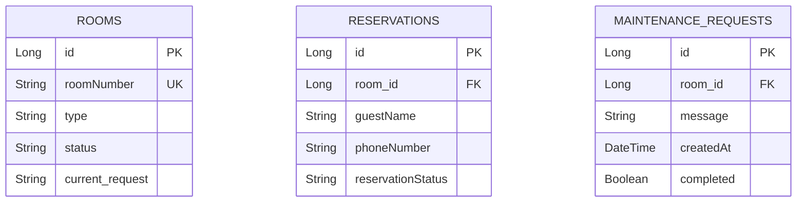

# Hotel Room Management Administrative

A full-stack management application for tracking hotel rooms, guest reservations, and maintenance tasks. This system is designed to automate manual record-keeping through a real-time digital dashboard.

## Live Deployment
* **Website:** https://rma-frontend-production.up.railway.app

## Tech Stack
This project utilizes a modern **Full-Stack** architecture:

| Layer | Technology |
| :--- | :--- |
| **Frontend** | React.js, Tailwind CSS, Axios |
| **Backend** | Java, Spring Boot, Spring Security |
| **Database** | PostgreSQL (Hosted on Railway) |
| **Deployment** | Railway |
| **Version Control** | GitHub |

---

## Deployment Guide (Railway)

### 1. Database Provisioning
1. Add a **PostgreSQL** service to your Railway project.
2. Railway automatically generates variables like `DATABASE_URL`, `PGUSER`, and `PGPASSWORD`.

### 2. Backend Configuration
1. Connect your GitHub repository to a new Railway Service.
2. In the **Variables** tab, map your Spring Boot properties to the Railway PostgreSQL variables:
   * `SPRING_DATASOURCE_URL`: `jdbc:postgresql://${{Postgres.PGHOST}}:${{Postgres.PGPORT}}/${{Postgres.PGDATABASE}}`
   * `SPRING_DATASOURCE_USERNAME`: `${{Postgres.PGUSER}}`
   * `SPRING_DATASOURCE_PASSWORD`: `${{Postgres.PGPASSWORD}}`
   * `SERVER_PORT`: `8080`
3. Ensure `SecurityConfig.java` allows the domain of your live frontend for **CORS** (Cross-Origin Resource Sharing).

### 3. Frontend Configuration
1. Connect your frontend folder to a new Railway Service.
2. Set the environment variable:
   * `REACT_APP_API_URL`: `https://rma-production-86dc.up.railway.app`
3. Railway will build the production assets using Nixpacks and serve them automatically.
---

## Database Structure
The system uses a relational database to manage hotel operations.

* **Rooms:** Stores room numbers, types, and statuses (`Available`, `Occupied`, `Cleaning`).
* **Reservations:** Manages guest info and links to room records.
* **Maintenance:** Tracks cleaning and repair tasks assigned to specific rooms.

---

## Key Features
* **Real-time Dashboard:** Instant visual updates on room availability.
* **Direct Check-in:** Quick check-in process for walk-in guests.
* **Maintenance Management:** Staff can create and delete specific room cleaning tasks.

**Short Video:** You can watch the demonstration [here](https://youtu.be/U2d4-i2tpKI).

**AI Usage Declaration:** You can view the full declaration [here](./AIUSAGE.md).
